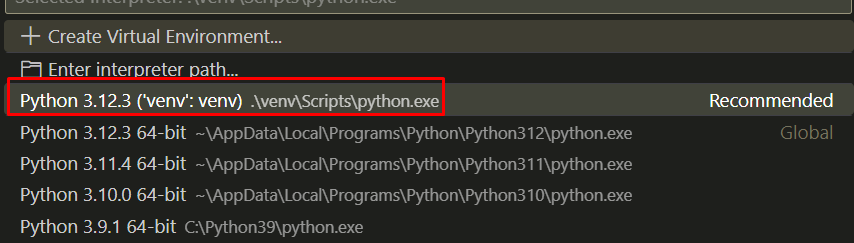
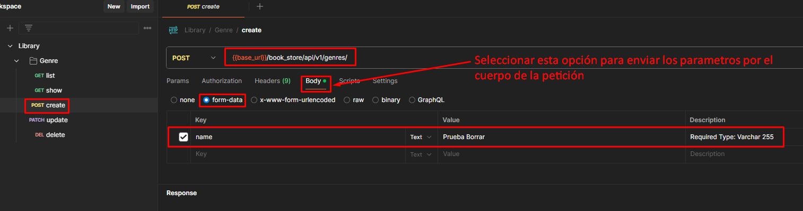
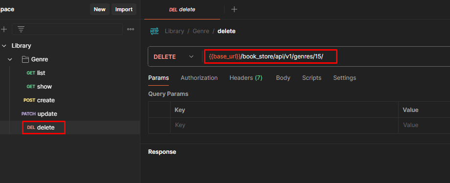

# <span style="color: red;">Django REST Framework</span>
Django REST Framework es una herramienta robusta que facilita la creación de APIs web seguras y eficientes en aplicaciones Django, permitiendo a los desarrolladores enfocarse en la lógica de negocio en lugar de en los detalles de implementación de la API.

## <span style="color: orange;">¿Qué es un framework?</span>

> Un framework (o marco de trabajo) es una plataforma de software diseñada para facilitar el desarrollo de aplicaciones y proporcionar una estructura estándar que los desarrolladores pueden seguir. Incluye un conjunto de herramientas, bibliotecas y reglas que ayudan a desarrollar software de manera más eficiente y estructurada. Los frameworks permiten reutilizar código y seguir buenas prácticas de programación, lo que puede mejorar la calidad del software y reducir el tiempo de desarrollo.

## <span style="color: orange;">Puntos clave sobre Django REST Framework</span>
1. **Serialización:** DRF facilita la conversión de datos complejos, como consultas de base de datos, a formatos de datos nativos de Python y viceversa, utilizando serializers. Esto es esencial para transformar los datos en un formato adecuado para la API (como JSON).
2. **Vistas y Viewsets:** Proporciona clases basadas en vistas y viewsets que simplifican la creación de endpoints de la API. Las vistas genéricas ayudan a realizar operaciones CRUD (Crear, Leer, Actualizar, Eliminar) de manera eficiente.
3. **Autenticación y Permisos:** Incluye soporte para múltiples esquemas de autenticación (token, sesión, OAuth) y permisos (permisos basados en roles, permisos a nivel de objeto) para controlar el acceso a la API.
4. **Paginación:** Facilita la paginación de respuestas largas, lo que es útil para manejar grandes conjuntos de datos y mejorar la eficiencia de las solicitudes.
5. **Documentación Automática:** Integra herramientas como Swagger y CoreAPI para generar automáticamente documentación interactiva para la API.
6. **Filtros y Búsqueda:** Proporciona capacidades para filtrar y buscar a través de los datos expuestos por la API, lo que permite a los usuarios recuperar datos específicos de manera eficiente.
7. **Soporte para Navegador:** Incluye una interfaz de navegación de API amigable para el desarrollador, que permite explorar y probar la API directamente desde el navegador.
8. **Integración con Django:** Se integra perfectamente con Django, aprovechando su ORM (Object-Relational Mapping), autenticación, y otros componentes.

## <span style="color: orange;">Índice</span>
- [Django REST Framework](#django-rest-framework)
  - [¿Qué es un framework?](#qué-es-un-framework)
  - [Puntos clave sobre Django REST Framework](#puntos-clave-sobre-django-rest-framework)
  - [Índice](#índice)
  - [Instalación](#instalación)
  - [Configurar de Base de Datos](#configurar-de-base-de-datos)
  - [Crear la Estructura de la Base de Datos](#crear-la-estructura-de-la-base-de-datos)
    - [Migraciones](#migraciones)
  - [Crear Serializadores](#crear-serializadores)
  - [Crear las vistas](#crear-las-vistas)
  - [Crear las rutas](#crear-las-rutas)
  - [Probar Aplicación](#probar-aplicación)
  - [Crear géneros literarios](#crear-géneros-literarios)

## <span style="color: orange;">Instalación</span>
1. Abrir una terminal en Visual Studio Code: `CTRL + Ñ`.
2. Instalación de un entorno virtual. Un entorno virtual es un directorio que contiene una instalación independiente de Python y una colección de paquetes y dependencias que pueden ser utilizados por un proyecto específico. Esto permite a los desarrolladores aislar los entornos de desarrollo para diferentes proyectos, evitando conflictos de dependencias y asegurando que cada proyecto tenga acceso a las versiones específicas de las librerías que necesita:
```bash
$ pip install virtualenv
```

3. Crear entorno Virtual en Python. En la carpeta llamada venv📦:
```bash
$ python -m venv venv
```


4. Oprimir `F1` y escribir:
```bash
Python: Select Interpreter
```
-  Seleccionamos la opción, Python 3.12.3 ('venv':venv)...


5. Matar cualquier terminar abierta en el Visual Studio Code y abrirla nuevamente usando `CTRL + Ñ`

Ahora debería indicarnos que nos encontramos dentro del entorno virtual.

6. Ahora es el momento de instalar Django desde el entorno virtual:
```bash
$ pip install django
```


7. Instalar el modulo Django REST Framework
```bash
$ pip install djangorestframework
```


8. Crear un nuevo proyecto:
```bash
$ django-admin startproject book_store_api .
```


9. Ejecutar proyecto:
```bash
$ python manage.py runserver
```
- Apretar `CTRL + CLIC` sobre el endpoint que arroja:


- La acción anterior debería abrir


10. Lo siguiente ahora es enlazar una aplicación:
- Primero paramos la ejecución del proyecto con `CTRL + C`
- Iniciar una nueva aplicación con:
```bash
$ python manage.py startapp book_store
```

- Añadir Django REST Framework y nuestra app al archivo de configuraciones de nuestro proyecto:


## <span style="color: orange;">Configurar de Base de Datos</span>
1. Instalar librería para conectar con el motor:
```bash
pip install psycopg2
```
2. Modificar la configuración de base de datos en el archivo `book_store_api/settings.py`:


3. Ir al pgAdmin y crear una base nueva base de datos.


## <span style="color: orange;">Crear la Estructura de la Base de Datos</span>

> [!NOTE]
> En Django, un modelo es una clase de Python que representa una tabla en la base de datos. Cada atributo de la clase representa una columna en la tabla. Los modelos son una parte fundamental del framework Django, ya que proporcionan una forma de definir y manipular datos de manera estructurada y orientada a objetos.
- Ir a `book_store/models.py` y crear todos los modelos necesarios que representaran las tablas en nuestra base de datos.


### <span style="color: orange;">Migraciones</span>
> [!NOTE]
> Las migraciones en Django son una característica clave que permite gestionar y aplicar cambios en la estructura de la base de datos de una manera controlada y reproducible. Se utilizan para sincronizar el esquema de la base de datos con los modelos definidos en el código de Django.
- Es importante realizar las migraciones necesarias para crear las tablas en la base de datos:
```bash
python manage.py makemigrations
```


- Y ahora ejecutamos las migraciones para que se creen las tablas en nuestra base de datos.
```bash
python manage.py migrate
```
- Esto genera toda la estructura de tablas que necesitamos las 4 que definimos y otras por defecto que Django genera automáticamente.


## <span style="color: orange;">Crear Serializadores</span>
Los serializadores son una herramienta fundamental que permite convertir instancias de modelos Django en representaciones JSON (u otros formatos) y viceversa.
- Crear un archivo llamado `serializer.py`


- Escribimos los serializadores necesarios en `serializers.py`


## <span style="color: orange;">Crear las vistas</span>
Las `views` (vistas) son componentes que manejan las solicitudes HTTP y devuelven las respuestas HTTP adecuadas. Son fundamentales para definir cómo se procesan las solicitudes y cómo se interactúa con los datos en una API
- Ir al archivo `views.py`


- Crear todas las vistas necesarias


## <span style="color: orange;">Crear las rutas</span>
En Django, las URLs (Uniform Resource Locators) son las direcciones que los usuarios utilizan para acceder a diferentes partes de una aplicación web. En Django REST Framework (DRF), las URLs también juegan un papel crucial para definir los puntos de acceso a las API.
- Crear el archivo el archivo `urls.py` para que se expongan los servicios de la API que vamos a consumir


- Definir todas la rutas en este archivo.


- Registrar nuestras urls en la aplicación principal


## <span style="color: orange;">Probar Aplicación</span>
1. Abrir Postman
2. Crear una nueva colección


3. Nombrar la colección


4. Crear un nuevo request


4.1. Renombrar el request a `list`


5. Crear un en Environment


- Escribir todos los valores correspondientes


- Seleccionar nuestro environment para poder utilizarlo en nuestros request


6. Escribir nuestra url


7. Crear un nuevo folder


- Llamar el folder `Genre`


- Arrastrar el request `list` al folder `Genre`


8. Dentro de `Genre` crear todos los request necesarios para hacer un CRUD son 5 request en total


> [!NOTE]
> Para elegir un verbo HTTP según corresponda lo podemos hacerlo desde el request
>
> 

> [!TIP]
> Para el resto de operaciones CRUD los request deben verse de esta manera:
> 
> `show` (Mostrar):
>
> 
>
> `create` (Crear):
>
> 
>
> `update` (Actualizar):
>
> 
>
> `delete` (Eliminar):
>
> 

## <span style="color: orange;">Crear géneros literarios</span>

Desde el request `create` (Crear), crear la siguiente lista de géneros literarios:

- Ciencia
- Novela negra
- Novela histórica
- Romántica
- Ciencia ficción
- Distopía
- Aventuras
- Fantasía
- Contemporáneo
- Terror
- Paranormal
- Poesía
- Juvenil
- Infantil

> [!IMPORTANT]
> Al crear un nuevo genero debemos visualizar una respuesta como esta:
>
> 

> [!NOTE]
> Una vez creados todos lo géneros literarios al consumir el servicio `list` (Listar) se debería visualizar la siguiente respuesta en formato JSON:
>
> 
>
> Podemos visualizar también esta información desde nuestra base de datos
>
> 